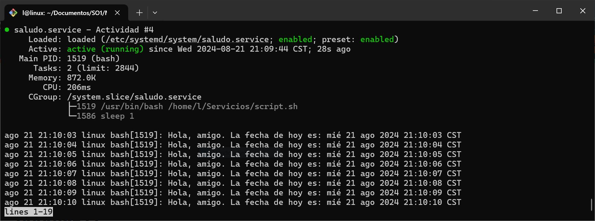
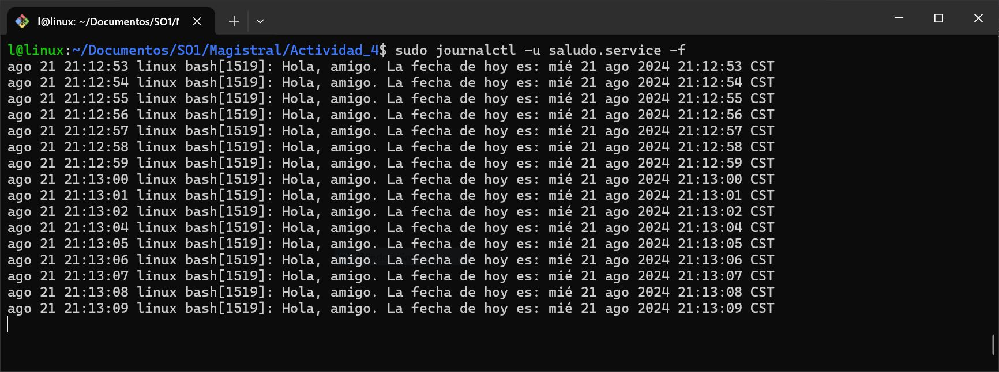

# Actividad #4

## Configuración de una "systemd unit"

<strong>1.</strong> Copiar el archivo de la `sytemd unit` a la carpeta `/etc/systemd/system`.

```
$ sudo cp /home/linux/saludo.service /etc/systemd/system/saludo.service
```

<strong>2.</strong> Para iniciar el servicio inmediatamente, usar el comando `sudo systemctl start <servicio>`. Para hacer que un servicio arranque cada vez que se reinicie el sistema se debe usar el comando `sudo sytemctl enable <servicio>`.

```
$ sudo systemctl start saludo.service
```

<strong>3.</strong> Para ver el estado del servicio utilizar el comando `sudo sytemctl status <servicio>`.

```
$ sudo systemctl status saludo.service
```

## Ver los logs del servicio

Para ver los logs del servicio existen varias opciones, entre ellas:

<strong>1.</strong> Para ver los logs de una unidad específica se utiliza el comando `sudo journalctl -u <servicio>`.

```
$ sudo journalctl -u saludo.servie

```

<strong>2.</strong> Para ver los logs de una unidad en tiempo real utilizar la opción `-f`.

```
$ sudo journalctl -u saludo.servie -f
```

<hr>

### Servicio en ejecución



### Logs en tiempo real


